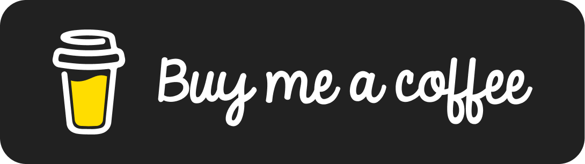

<h1 align="center">Foggy</h1>

  
  

  When it's foggy, clear your mind while coding.
   
  LeetCode and practice exercises repo, built with Go for learning purposes.

  
   
  
   
  
   
  

### Table of Contents

- [/exercises](exercises)
  - [Exercises List](exercises/README.md)
- [/solutions](solutions)

### License

[MIT](LICENSE)